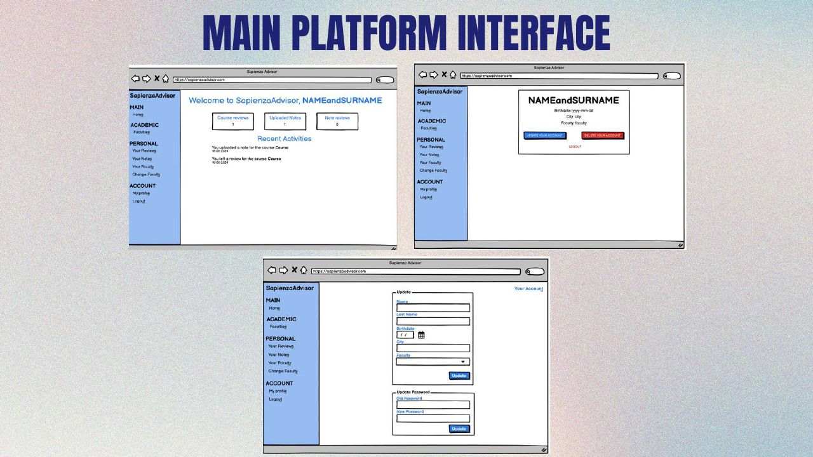
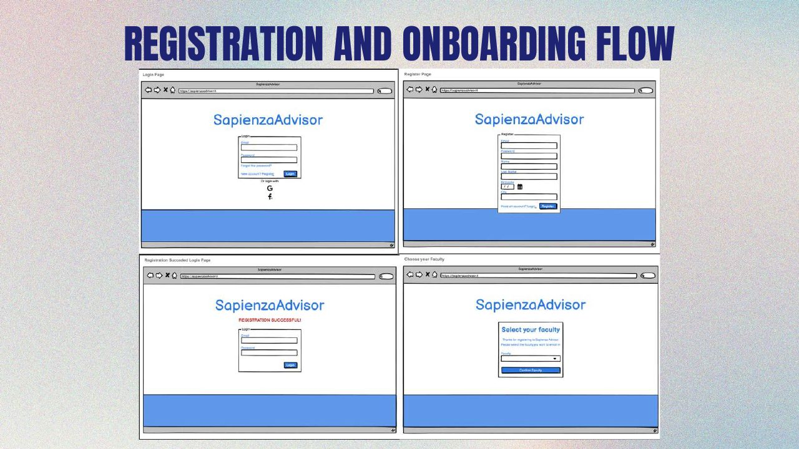
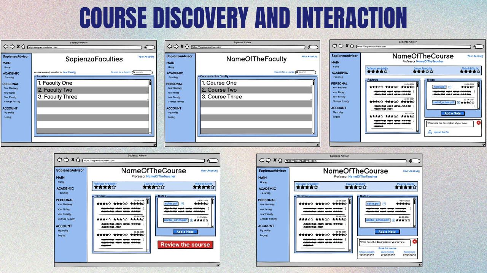
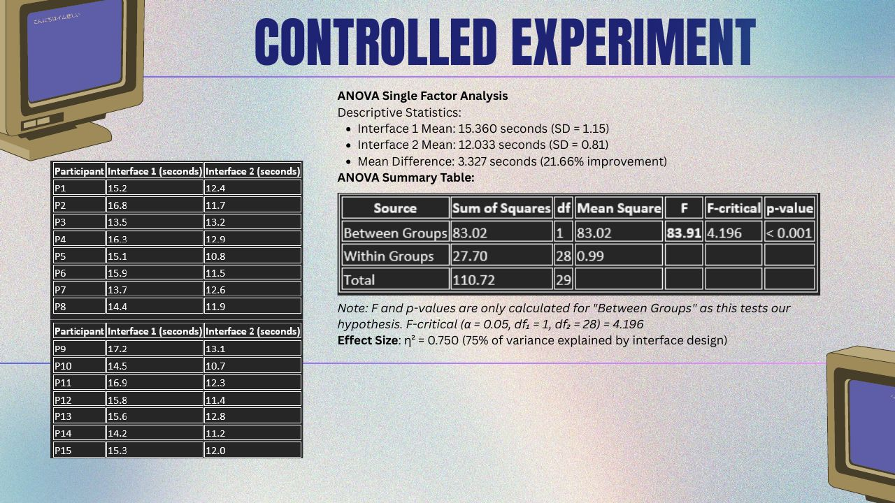

# SapienzaAdvisor

**A student-centered academic platform for course reviews and study-material sharing**, designed through a full **user-centered design process**.
Team project for the *Human-Computer Interaction* course, Master of Science in Engineering in Computer Science, Sapienza University of Rome (A.Y. 2024/2025).

> This repository documents a **UX research and interaction design project**: requirements, task analysis, mock-ups, prototypes and evaluation. The full report and presentation are in [`docs/`](docs).

---

## The idea

Course information at university is scattered across WhatsApp and Telegram groups, forums and word of mouth. **SapienzaAdvisor** brings it into one place:

- Students **register under their degree program** and get a **personalized dashboard** with all its courses
- **Multi-dimensional course reviews**: lesson clarity, course feasibility, material clarity, difficulty and workload
- A **peer-rated repository of study materials** (notes, summaries, exercises), where community ratings keep quality high
- **Review reporting** to keep the content trustworthy

## Design process

### 1. Requirement analysis
- **Competitor analysis**: Moodle, Google Classroom, StuDocu, Piazza, Discord, Telegram and WhatsApp groups. Each covers only part of what students need.
- **User profile and 3 personas with scenarios**: a Master's student choosing electives, a Biomedical Engineering student preparing an exam, and an Erasmus exchange student.
- **Questionnaire with 37 respondents** from 27+ fields of study:
  - **92%** rated the platform idea as useful (4–5 out of 5, average **4.46/5**)
  - **51.4%** say *student reviews* are their top criterion when choosing a course
  - **54.1%** currently rely on Telegram/WhatsApp groups, confirming how fragmented the landscape is
  - Trust in peer feedback is only moderate (**3.27/5**), which led to design choices around **quality assurance and reporting**

### 2. Task analysis
**Hierarchical Task Analysis (HTA)** and **State Transition Networks (STN)** for the two core tasks:
- *Find and select a useful review for a course*
- *Upload study material to the platform*

### 3. Mock-ups and prototype
Mock-ups for onboarding, the main interface, course discovery and personal content management, then refined into a prototype. The team also built a working prototype of the final design. Its code is not part of this repository, which focuses on the design and evaluation work.

| Onboarding | Course discovery |
|---|---|
|  |  |

### 4. Evaluation

**Expert-based: heuristic evaluation** with Nielsen's 10 heuristics. The first mock-up violated 8 of them. Each issue was rated by severity and fixed in the first prototype, for example:
- missing email and password validation hints (severity 3)
- no guidance on accepted file formats and sizes (severity 3)
- missing cancel options and help tooltips

**User-based: think-aloud protocol** with **10 participants** on the two core tasks. It led to:
- **advanced review filtering and sorting** (by clarity, feasibility, date), because users felt overwhelmed by long review lists
- **explicit confirmation feedback** after uploads and review submissions

**Controlled experiment: which "Report review" UI is faster?**
- Within-subjects design, **15 students**, counterbalanced groups
- *Three-dots menu → Report* vs. *direct Report button*
- **One-way ANOVA**: F = 83.91 > F-crit = 4.196, **p < 0.001**, η² = 0.75
- The direct button was **21.7% faster** (12.0 s vs. 15.4 s), and every participant was faster with it, so it was adopted in the final design

## Final feature set

User registration and authentication · personalized dashboard · faculties overview · advanced course discovery · course overview · multi-dimensional course reviews · advanced review filtering · review reporting · study-material repository · personal content management

**Future work**: ML-based course recommendations, integration with the university's systems for course data and enrollment verification, and gamification (reputation and incentives) to encourage contributions.

## Documents

- [Project report (PDF)](docs/report.pdf)
- [Presentation slides (PDF)](docs/presentation.pdf)

## Team

Federico Turrini · Leonardo Ricca · **Bogdan Andrei Tutuianu** ([@bogX2](https://github.com/bogX2)) · Igor Pasquini ([@igor224659](https://github.com/igor224659))

Course instructors: Prof. Tiziana Catarci, Valeria Mirabella, Srikanth Varma
